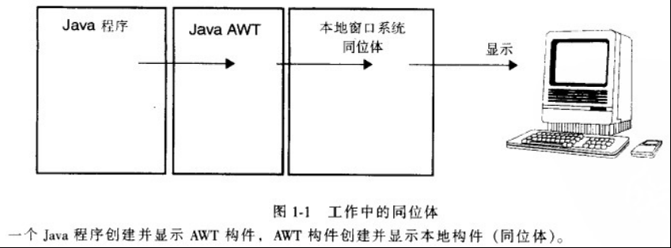

# 简介
Java 基本类(JFC) 软件包主要包括下面API:
- 抽象窗口工具集(AWT)
- Swing组件
- Java 2D API
- 兼容程序接口

AWT为JFC的核心，为JFC提供了以下基本结构：
- 代理事件模型
- 轻量构建
- 剪贴板和数据传输
- 打印和无鼠标操作

AWT给用户提供了基本的界面构建。包括用于创建用户界面和绘制图形图像的所有类。在AWT术语中，诸如按钮或滚动条之类的用户对象称为组件。`Component` 类是所有AWT组件的根，包含了所有AWT组件的公共属性。

AWT提供的通用类在引用时不需要考虑特定的窗口平台，同位体(peer)属于这种 AWT 类集。同为体是一种本地图形用户接口(GUI)构建，由AWT管理。AWT构件中包含了大量对同为体的实用操作。例如，如果使用AWT创建一个menu类实例，那么当Java运行时，系统将创建一个菜单同位体的实例，并由创建的同为体执行菜单的显示和管理。在创建菜单实例时，在Solaris JDK中会产生一个Motif菜单同位体；Windows 95 产生一个Windows 95 菜单同位体等等。AWT类仅仅是同位体外围的包装与操作工具。

# 轻量构件        

AWT构件全都是重量构件，即它们都具有同位体，并且在本地窗口中显示。这样将花费昂贵的代价，且不灵活。

后来引入了轻量构件的概念。轻量构件直接扩展了`java.awt.Component` 或`java.awt.Container`。轻量构件没有同位体，在其重量容器窗口中显示，而不是在其本身窗口中显示。轻量构件不会导致与它们自己关联的不透明窗口的性能损失，而且还可以有透明的背景。有透明的背景意味着即使轻量构件的界限域实际上是矩形的，它也可以显示为非矩形。

# AWT构件
|构件|超类|功能|
|---|---|---|
|`Button`|`Component`|触发行为的文本按钮|
|`Canvas`|`Component`|绘制图形的画布|
|`Checkbox`|`Component`|可检验的布尔构件|
|`Choice`|`Component`|文本输入的弹出菜单|
|`Dialog`|`Window`|可模式化窗口|
|`Filedialog`|`Dialog`|选择文件的平台相关对话框|
|`Frame`|`Window`|具有标题栏和可选菜单的顶层窗口|
|`Label`|`Component`|显示字符串的构件|
|`List`|`Component`|文本输入的可滚动列表|
|`Panel`|`Container`|一般容器|
|`Scrollbar`|`Component`|滚动项目的adjustable构件|
|`Scrollpane`|`Container`|可滚动容器|
|`Textarea`|`TextComponent`|多行可滚动的文本框|
|`TextComponent`|`Component`|TextArea和TextField的基本功能|
|`TextField`|`TextComponent`|输入文本的单行构件|
|`Window`|`Container`|没有标题的无边界窗口|

# Contaner 子类
|子类|说明|
|---|---|
|Applet|Panel.Applet的扩展，是所有Appet的超类|
|Dialog|可模式化或非模式化的Window的扩展|
|FieldDialog|用于选择文件的对话框|
|Frame|Window的扩展，Frame是应用程序的容器，可有有菜单条，而Applet则不能有|
|Panel|Container的扩展，Panel是一个简单的容器|
|ScrollPane|滚动构件|
|Window|Container的扩展，Window没有菜单或边界，很少被直接扩展，是Frame和Dialog的超类。|

# 布局管理器
布局管理器用于指定容器中构件的位置和尺寸。AWT提供了5种类型的布局管理器。

|类型|样式|
|---|---|
|BorderLayout|东南西北中五个区域|
|CardLayout|将容器的构件视为卡片栈，把每个构件放在一个单独的卡片上，而每次只能看见一张卡片|
|FlowLayout|从左到右、从上到下放置|
|GridLayout|将容器分成相同尺寸的网格，将构建按从左到右、从上到下的顺序放在网格中|
|GridBagLayout|和上面不同的是，一个构件可以占多个网格，加入构件时，必须指明一个对应的参数|
