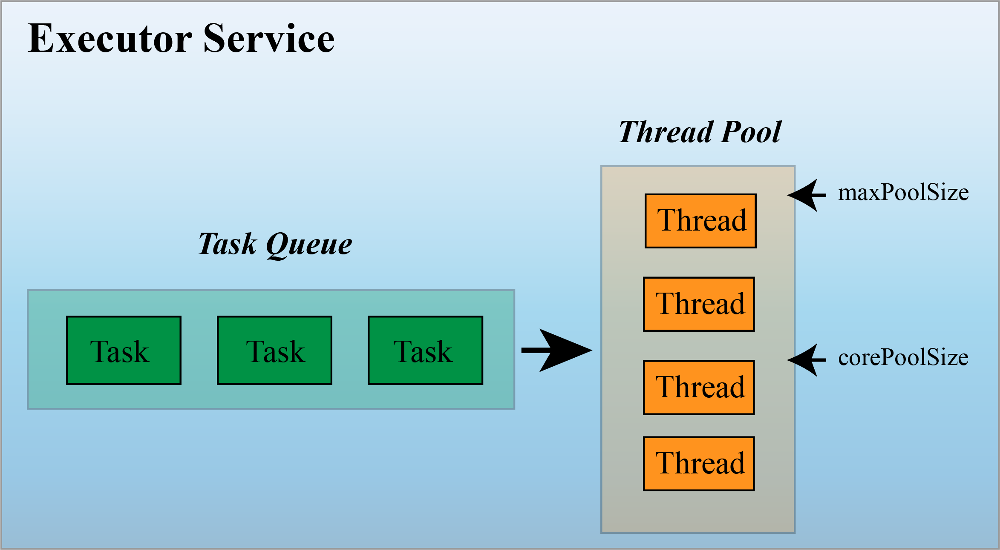
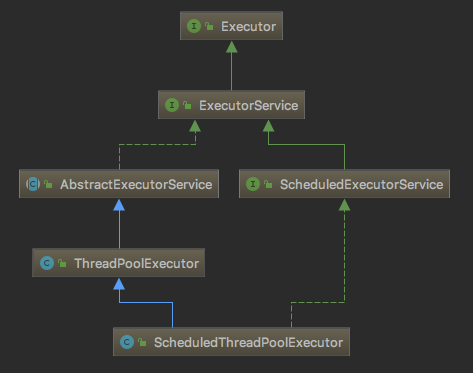

# 线程池

在 Java 中线程的创建和销毁开销都很大，除了任务执行所需要的开销，系统还需要为线程分配资源及额外的内存开销。因此反复创建线程开销会很大，降低系统效率。

线程池存放已经创建好的线程，将任务提价给线程池，线程池使用已创建的线程执行任务。线程池使得线程可以重复使用，在降低创建线程的开销的同时简化了线程的管理工作。

线程池存在的意义：

1. 减少在创建和销毁线程上所花的时间以及系统资源的开销；
2. 将当前任务与主线程隔离，能实现和主线程的异步执行，特别是很多可以分开重复执行的任务。

## 线程池原理

线程池管理一堆已经创建好的线程，并负责执行提交的任务。当提交的任务大于线程池中线程的数目，可以创建新的线程执行任务，也可以将该任务放入一个队列，等其它任务执行完有了空闲线程再执行。因此一个线程池至少需要如下功能：

- 任务队列，用于缓存提交待执行的任务；
- 线程数量管理
  - 初始线程数量, init
  - 线程数量不足时，最大允许的扩充数量, max
  - 线程池空闲时，释放线程，最低保留的线程数目，core
- 拒绝任务策略：如果线程池和队列均已满，需要有相应的策略拒绝任务；
- 线程工厂：用来创建线程；
- QueueSize：用来存放提交的 `Runnable` 或 `Callable` 任务；

线程池的基本结构如下所示：



## 线程池 API

线程池的核心API如下所示：



说明：

- `Executor` 是最基础的执行线程接口；
- `ExecutorService` 接口扩展 `Executor`，并添加了管理方法 `submit()`, `shutdown()`等方法；
- `AbstractExecutorService` 抽象类实现了 `ExecutorService` 接口中的大部分方法；
- `ThreadPoolExecutor` 为线程池的具体实现类；
- `ScheduledExecutorService` 接口扩展了 `ExecutorService` 接口，添加了周期执行的功能；
- `ScheduledThreadPoolExecutor` 是 `ScheduledExecutorService` 的具体实现类；

## 线程池实现

为了更好的理解线程池，下面自定义实现一个简单的线程池。

线程池接口定义：

```java
public interface JThreadPool{

    /**
     * submit task to thread pool
     */
    void execute(Runnable runnable);

    /**
     * close thread pool
     */
    void shutdown();

    /**
     * @return the initial size of the thread pool
     */
    int getInitSize();

    /**
     * @return the allowed maximum number of threads
     */
    int getMaxSize();

    /**
     * @return the number of core threads
     */
    int getCoreSize();

    /**
     * @return the queue size
     */
    int getQueueSize();

    /**
     * @return the number of active threads
     */
    int getActiveCount();

    /**
     * @return true if this pool is shutdown
     */
    boolean isShutdown();
}
```

任务队列接口：

```java
public interface JTaskQueue{

    /**
     * add a task to the queue
     */
    void offer(Runnable runnable);

    /**
     * @return task a task from the header
     */
    Runnable take();

    /**
     * @return number of task in this queue
     */
    int size();
}
```

线程工厂接口：

```java
public interface JThreadFactory{
    /**
     * Create a Thread for a task
     */
    Thread createThread(Runnable runnable);
}
```

拒绝策略，当队列已满时，对新添加的任务采取的策略：

```java
public interface JDenyPolicy{
    void reject(Runnable runnable, JThreadPool threadPool);

    /**
     * 直接舍弃，不作其它处理
     */
    class JDiscardDenyPolicy implements JDenyPolicy{
        @Override
        public void reject(Runnable runnable, JThreadPool threadPool)
        {
            // do nothing
        }
    }

    /**
     * 舍弃并抛出异常
     */
    class JAbortDenyPolicy implements JDenyPolicy{

        @Override
        public void reject(Runnable runnable, JThreadPool threadPool){
            throw new JRunnableDenyException("The task " + runnable + " is abort.");
        }
    }

    /**
     * 接受并执行
     */
    class JRunnerDenyPolicy implements JDenyPolicy{
        @Override
        public void reject(Runnable runnable, JThreadPool threadPool){
            if (!threadPool.isShutdown()) {
                runnable.run();
            }
        }
    }
}
```

对应的异常为：

```java
public class JRunnableDenyException extends RuntimeException
{
    public JRunnableDenyException(String message)
    {
        super(message);
    }
}
```

JInternalTask，用于从队列中取出任务执行：

```java
public class JInternalTask implements Runnable
{
    private final JTaskQueue taskQueue;

    private volatile boolean running = true;

    public JInternalTask(JTaskQueue taskQueue)
    {
        this.taskQueue = taskQueue;
    }

    @Override
    public void run()
    {
        while (running && !Thread.currentThread().isInterrupted()) {
            try {
                Runnable task = taskQueue.take();
                task.run();
            } catch (Exception e) {
                running = false;
                break;
            }
        }
    }

    /**
     * 停止当前任务
     */
    public void  stop(){
        this.running = false;
    }
}
```

其中添加的 stop 方法，方面停止当前线程，用在维护线程池线程数目和销毁线程池方面。

## ExecutorService
|方法|说明|
|---|---|
|invokeAny()|接收一个任务列表，运行任务，返回第一个没有抛出异常的任务的执行结果|

## invokeAll
一次提交多个 `Callable` 任务执行。

## invokeAny
类似于

## submit vs. invokeAll
`submit` 用于一次提交一个任务，`invokeAll` 用于一次提交多个任务。

如果不需要等待所有任务完成，可以使用 `submit`，如果需要