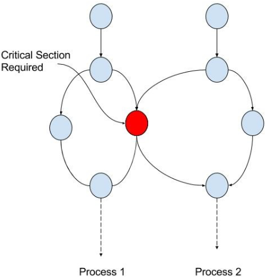

# Critical section

在并发编程中，对共享资源的并发访问可能导致意外或错误的行为，因此对共享资源访问的代码需要进行保护，以避免并发访问，被保护的部分就是临界区（critical section 或 critical region）。

临界区一次只允许一个进程进入其中执行代码，临界区一般包含对共享资源的访问，如数据结构、外围设备或网络连接等，这类共享资源在并发访问时无法正常执行。

例如，不同代码或线程可能包含对相同变量或资源的读写操作，此时执行结果依赖于线程执行的顺序。例如，假设线程 A 读取变量 x，同时线程 B 对 x 进行写操作，则线程 A 可能得到x的原值，也可能得到新值。如下图所示：



线程 A：

```java
// Process A
 .
 .
 b = x + 5;               // instruction executes at time = Tx
 .
```

线程 B：

```java
// Process B
.
.
x = 3 + z;               // instruction executes at time = Tx
.
```

对这种情况，临界区十分重要。如果我们希望A获得 x 的新值，线程A和B同时执行是无法保证的。为了实现该目的，需要用临界区将变量 x  保护起来。首先，线程 B 访问临界区，写入值后，A 进去临界区，获得 x 的新值。

通过仔细控制在临界区中修改的变量，可以防止对共享变量的并发访问。

## 临界区的实现

在不同 OS 中临界区的实现有所不同。

临界区通常会在有限的时间内终止，线程、任务或进程等待固定时间后进入。为了保证对临界区的独占访问，在进入和离开临界区时需要同步机制。

所以，临界区其实就是需要互斥访问的一段代码。如下图所示，是使用锁实现临界区的方式，当线程需要使用共享资源，先获取资源锁，锁定资源后，其它线程无法访问，要等前一个线程释放锁离开临界区，才能轮流进入。很好的防止了多线程同时访问共享资源的问题。


实现临界区的最简单方式是信号量（semaphore）。在单处理器系统中实现临界区的方法：

- 进入临界区时禁用中断
- 在临界区避内免导致上下文切换的系统调用
- 在退出临界区时如遇到中断，恢复到之前的状态

在该实现，任何进入临界区的线程将阻止其它线程（包括中断）获取CPU时间，因此其它线程也无法进入其它临界区，直到原线程离开临界区。

可以使用多信号量改进这种蛮力方法。线程必须先获得信号量才能进入临界区，在离开时释放信号量。这样可以防止其它线程和原线程进入相同的临界区，但是可以获得CPU时间，也可以执行其它代码，包括进入受其它信号量保护的其它临界区。而且，信号量锁还有时间限制，以防止死锁的情况。

## Reference

- [wikipedia](https://en.wikipedia.org/wiki/Critical_section)