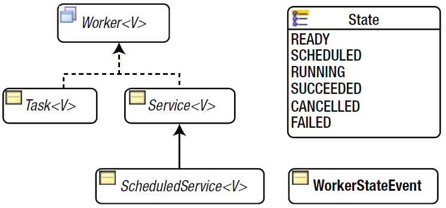
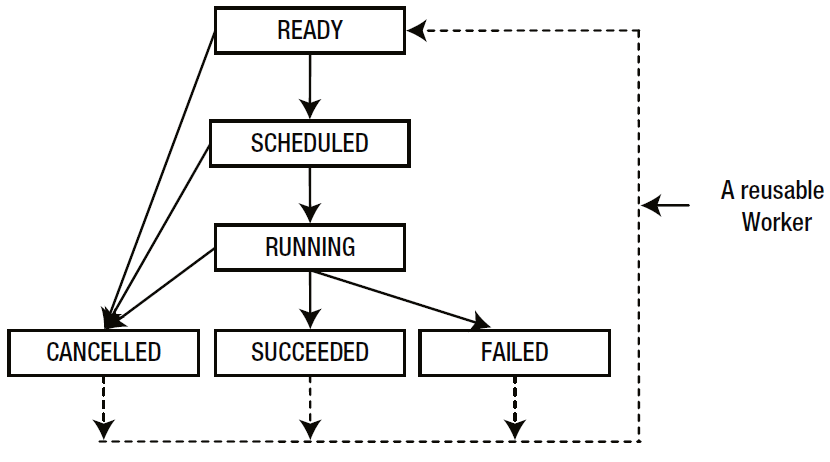

# JavaFX Concurrency

- [JavaFX Concurrency](#javafx-concurrency)
  - [简介](#%e7%ae%80%e4%bb%8b)
  - [并发框架 API](#%e5%b9%b6%e5%8f%91%e6%a1%86%e6%9e%b6-api)
  - [`Worker<V>` 接口](#workerv-%e6%8e%a5%e5%8f%a3)
    - [`Worker` 状态](#worker-%e7%8a%b6%e6%80%81)
    - [`Worker` 属性](#worker-%e5%b1%9e%e6%80%a7)
  - [Task](#task)
    - [创建 Task](#%e5%88%9b%e5%bb%ba-task)
    - [更新 Task 属性](#%e6%9b%b4%e6%96%b0-task-%e5%b1%9e%e6%80%a7)
    - [监听任务进程](#%e7%9b%91%e5%90%ac%e4%bb%bb%e5%8a%a1%e8%bf%9b%e7%a8%8b)
    - [取消任务](#%e5%8f%96%e6%b6%88%e4%bb%bb%e5%8a%a1)
    - [执行任务](#%e6%89%a7%e8%a1%8c%e4%bb%bb%e5%8a%a1)
  - [`Service<V>`](#servicev)
    - [创建 Service](#%e5%88%9b%e5%bb%ba-service)
    - [更新 Service 属性](#%e6%9b%b4%e6%96%b0-service-%e5%b1%9e%e6%80%a7)
    - [监听 Service 状态](#%e7%9b%91%e5%90%ac-service-%e7%8a%b6%e6%80%81)
  - [参考](#%e5%8f%82%e8%80%83)

2020-05-22, 10:26
***

## 简介

JavaFX 和 Swing、AWT 一样，使用一个专用线程处理 UI 事件，即 JavaFX Application Thread (JAT)。JavaFX 正在使用的 UI 元素只能通过 JAT 访问。`Scene` 中的 UI 节点不是线程安全的，由于不涉及同步，这种设计更快；这种设计的缺点是，必须从 JAT 线程访问这些 UI 元素。必须从 JAT 线程访问 UI 元素隐含了另一个限制，即 UI 事件不应该用于处理耗时任务，否则会导致GUI无响应。

例如，下面是一个典型无响应GUI：

```java
import javafx.application.Application;
import javafx.scene.Scene;
import javafx.scene.control.Button;
import javafx.scene.control.Label;
import javafx.scene.layout.HBox;
import javafx.scene.layout.VBox;
import javafx.stage.Stage;

public class UnresponsiveUI extends Application
{
    public static void main(String[] args)
    {
        launch(args);
    }

    Label statuslbl = new Label("Not Started...");
    Button startBtn = new Button("Start");
    Button exitBtn = new Button("Exit");

    @Override
    public void start(Stage primaryStage) throws Exception
    {
        // add event handlers to the buttons
        startBtn.setOnAction(e -> runTask());
        exitBtn.setOnAction(e -> primaryStage.close());

        HBox buttonBox = new HBox(5, startBtn, exitBtn);
        VBox root = new VBox(10, statuslbl, buttonBox);
        Scene scene = new Scene(root);

        primaryStage.setScene(scene);
        primaryStage.setTitle("An Unresponsive UI");
        primaryStage.show();
    }

    private void runTask()
    {
        for (int i = 1; i <= 10; i++) {
            String status = "Processing " + i + " of " + 10;
            statuslbl.setText(status);
            System.out.println(status);
            try {
                Thread.sleep(1000);
            } catch (InterruptedException e) {
                e.printStackTrace();
            }
        }
    }
}
```

点击 `Start` 按钮启动任务，该任务耗时 10 秒，直接在 JAT 中执行，在这 10 秒界面无响应。要解决该问题，必须将耗时任务移到单独的线程执行。

另外，如果要在其他线程修改 JavaFX UI，可以通过 `Platformat` 的方法：

```java
public static boolean isFxApplicationThread()
public static void runLater(Runnable runnable)
```

`isFxApplicationThread()`  判断当前线程是否为 JAT 线程。

`runLater()` 将指定 `Runnable` 任务添加到 JAT 线程运行，用于在其它线程更新 UI 组件。下面是前面代码的正确版本：

```java
import javafx.application.Application;
import javafx.application.Platform;
import javafx.scene.Scene;
import javafx.scene.control.Button;
import javafx.scene.control.Label;
import javafx.scene.layout.HBox;
import javafx.scene.layout.VBox;
import javafx.stage.Stage;

public class ResponsiveUI extends Application
{
    Label statusLbl = new Label("Not Started...");
    Button startBtn = new Button("Start");
    Button exitBtn = new Button("Exit");

    @Override
    public void start(Stage stage) throws Exception
    {
        // Add event handlers to the buttons
        startBtn.setOnAction(e -> startTask());
        exitBtn.setOnAction(e -> stage.close());

        HBox buttonBox = new HBox(5, startBtn, exitBtn);
        VBox root = new VBox(10, statusLbl, buttonBox);
        Scene scene = new Scene(root);
        stage.setScene(scene);
        stage.setTitle("A Responsive UI");
        stage.show();
    }

    public void startTask()
    {
        // Create a Runnable
        Runnable task = this::runTask;

        // Run the task in a background thread
        Thread backgroundThread = new Thread(task);

        // Terminate the running thread if the application exits
        backgroundThread.setDaemon(true);

        // Start the thread
        backgroundThread.start();
    }

    public void runTask()
    {
        for (int i = 1; i <= 10; i++) {
            try {
                String status = "Processing " + i + " of " + 10;

                // Update the Label on the JavaFx Application Thread
                Platform.runLater(() -> statusLbl.setText(status));
                System.out.println(status);
                Thread.sleep(1000);
            } catch (InterruptedException e) {
                e.printStackTrace();
            }
        }
    }
}
```

需要注意的是，更新 UI 组件方法 `Platform.runLater(() -> statusLbl.setText(status))`。

另外，设置工作线程为 Daemon 线程 `backgroundThread.setDaemon(true)`，这样先退出界面后，不会还有线程在后台执行。

JavaFX 提供了一个可运行一个或多个后台线程，并将状态更新到 GUI 程序的并发框架。下面对该框架进行讨论

## 并发框架 API

JavaFX 并发框架构建在 `java.util.concurrent` 之上，单纯的用于GUI 环境，其类图如下：



很小的一个包，包括 1 个接口，4个类和一个 enum。  

- `Worker` 接口表示需要在后台线程执行的任务，任务的状态可以在 JAT 中查看。  
- `Task`, `Service`, `ScheduledSerivice` 均实现了 Worker 接口，表示不同类型的任务。

| 类                 | 说明                     |
| ------------------ | ------------------------ |
| `Task`             | 一次性任务，不能重复执行 |
| `Service`          | 可重复执行任务           |
| `ScheduledService` | 根据指定间隔定期重复运行 |

`Worker.State` enum 表示 `Worker` 的不同状态。

`WorkerStateEvent` 表示 `Worker` 状态改变的事件，可以监听这些事件。

## `Worker<V>` 接口

`Worker<V>` 接口定义了 JavaFX 并发模块执行任务需要的常用方法。

泛型参数 `V` 指定了 `Worker` 返回的结果类型，如果不返回任何结果，使用 `Void`。

任务执行的状态为 observable，然后发送到 JAT和 scene graph 交流。

### `Worker` 状态

`Worker.State` enum 定义 `Worker` 所处的状态。在任务执行期间，Worker 的状态变化如下：



说明：

- 刚创建的 `Worker`，处于 `READY` 状态
- 在开始执行前，转到 `SCHEDULED`
- 执行时，处于 `RUNNING`
- 成功执行结束，转到 `SUCCEEDED`
- 执行过程出现异常，转到 `FAILED`
- 如果任务被取消，可能从 `READY`, `SCHEDULED`, `RUNNING` 转到 `CANCELLED`

另外，还可能从 `CANCELLED`, `SUCCEEDED`, `FAILED` 转到 `READY`，如上图虚线所示。

### `Worker` 属性

Worker 包含 9 个只读属性，在创建 `Worker` 时可以指定这些属性，在任务执行过程中也可以更新。

| 属性      | 描述                                                        |
| --------- | ----------------------------------------------------------- |
| title     | 任务标题                                                    |
| message   | 任务执行过程中的信息                                        |
| running   | `Worker` 是否在执行，`SCHEDULED` 或 `RUNNING` 状态为 true   |
| state     | `Worker` 状态，`State` enum 类型                            |
| totalWork | 任务总量，-1 表示未知                                       |
| workDone  | 已完成任务数，-1 表示未知                                   |
| progress  | `workDone` 和 `totalWork` 的比值，-1 表示未知               |
| value     | 任务执行结果，`Worker` 处于 `SUCCEEDED` 状态时才可能为 non-null |
| exception | 任务执行抛出的异常，处于 `FAILED` 状态时才为 non-null       |

在任务执行过程中，一般需要将任务执行的过程更新到UI。JavaFX 并发框架保证 `Worker` 属性更新到 JAT。另外，还可以添加 `Invalidation` 和 `ChangeListener` 到这些属性。

## Task

`Task<V>` 表示一次性任务。任务结束、取消或者失败后，无法重启。由于 `Task<V>` 实现了 `Worker<V>` 接口，因此继承了 `Worker` 的所有属性和方法。

`Task<V>` 继承自 `FutureTask<V>` 类，该类实现了 `Future<V>`, `RunnableFuture<V>` 以及 `Runnable` 接口，因此 `Task<V>` 也实现的所有这些接口。

### 创建 Task

扩展 `Task<V>`，并实现 `call()` 方法即可。`call()` 包含任务逻辑。

```java
// A Task that produces an ObservableList<Long>
public class PrimeFinderTask extends Task<ObservableList<Long>> {
  @Override
  protected ObservableList<Long>> call() {
    // Implement the task logic here...
  }
}
```

### 更新 Task 属性

Task 提供了如下更新属性的方法:

```java
protected void updateMessage(String message)
protected void updateProgress(double workDone, double totalWork)
protected void updateProgress(long workDone, long totalWork)
protected void updateTitle(String title)
protected void updateValue(V value)
```

使用 `updateValue()` 可以提交部分结果，任务的最终结果是 `call()` 方法的返回值。

### 监听任务进程

Task 包含如下几个添加监听器的方法：

- onCalcelled
- onFailed
- onRunning
- onScheduled
- onSucceeded

### 取消任务

`cancel()` 有两个重载方法：

```java
public final boolean cancel()
public boolean cancel(boolean mayInterruptIfRunning)
```

第一个将任务从任务队列中移除，如果任务已经在执行，则停止任务执行；第二个表示是否中断正在执行任务的线程。

在 `call()` 方法中要处理 `InterruptedException`，检测到该 异常，应当尽快结束 `call()` 方法，否则调用 `cancel(true)` 可能无法可靠的取消任务。

### 执行任务

`Task` 是 `Runnable`，也是 `FutureTask`。要运行`Task`，需要创建后台线程后 `ExecutorService`。

```java
// Schedule the task on a background thread
Thread backgroundThread = new Thread(task);
backgroundThread.setDaemon(true); // 设置为守护线程，这样退出界面后，不会有后台线程继续执行
backgroundThread.start();

// Use the executor service to schedule the task
ExecutorService executor = Executors.newSingleThreadExecutor();
executor.submit(task);
```

## `Service<V>`

`Service<V>` 同样实现了 `Worker<V>` 接口，该类对 `Task<V>` 进行包装，使得 `Task<V>` 可以重复利用。

### 创建 Service

`Service` 对 `Task` 进行保证，所以创建 `Service`，首先要获得一个 `Task`。`Service` 类包含一个 `createTask()` 方法，该方法返回 `Task`。所以创建 `Service`，需要继承 `Service`，并实现 `createTask()` 方法。

例如：

```java
// Create a service
Service<ObservableList<Long>> service = new Service<ObservableList<Long>>() {
  @Override
  protected Task<ObservableList<Long>> createTask() {
    // Create and return a Task
    return new PrimeFinderTask();
  }
};
```

每次 service 启动或者重启时，`createTask()` 方法都会被调用。

### 更新 Service 属性

`Service` 包含 `Worker` 的所有属性，另外还添加了 `java.util.concurrent.Executor` 类型的 `executor` 属性，该属性用于运行 `Service`，如果没有指定，会创建一个守护线程运行 Service。

和 `Task` 类不同，`Service` 没有 updateXxx() 系列方法，其属性和底层的 `Task<V>` 绑定，在 `Task` 中更新的属性，会直接更新到 `Service`。

### 监听 Service 状态

## 参考

- [Oracle Documentation](https://docs.oracle.com/javase/8/javafx/interoperability-tutorial/concurrency.htm)
- Learn JavaFX 8: Building User Experience and Interfaces with Java 8
