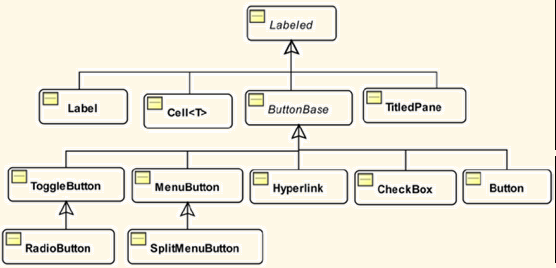

# 标记控件（Labeled Controls）

- [标记控件（Labeled Controls）](#%e6%a0%87%e8%ae%b0%e6%8e%a7%e4%bb%b6labeled-controls)
  - [简介](#%e7%ae%80%e4%bb%8b)
  - [属性](#%e5%b1%9e%e6%80%a7)
    - [换行](#%e6%8d%a2%e8%a1%8c)
  - [设置图像和文本的位置](#%e8%ae%be%e7%bd%ae%e5%9b%be%e5%83%8f%e5%92%8c%e6%96%87%e6%9c%ac%e7%9a%84%e4%bd%8d%e7%bd%ae)
  - [助记符和快捷键](#%e5%8a%a9%e8%ae%b0%e7%ac%a6%e5%92%8c%e5%bf%ab%e6%8d%b7%e9%94%ae)
  - [Label](#label)
  - [Button](#button)

2020-05-24, 09:58
***

## 简介

标记控件包含一个只读的文本和一个可选的图形作为其UI的一部分。`Label`, `Button`, `CheckBox`, `RadioButton` 和 `Hyperlink` 都是 JavaFX 中的标记控件。所有的标记控件，都直接或间接的继承 `Labeled` 类。

部分类图如下：



## 属性

`Labeled` 类声明了 `text` 和 `graphic`属性，分别表示文本和图像内容，如下表：

| 属性            | 类型                             | 说明                                                                                                   |
| --------------- | -------------------------------- | ------------------------------------------------------------------------------------------------------ |
| alignment       | `ObjectProperty<Pos>`            | 控件内容对齐方式。默认为 Pos.CENTER_LEFT                                                               |
| cententDisplay  | `ObjectProperty<ContentDisplay>` | 图像相对文本的位置                                                                                     |
| ellipsisString  | `StringProperty`                 | 当文本占据的空间比控件大，末尾显示的文本，默认为省略号"..."                                            |
| font            | `ObjectProperty<Font>`           | 文本的默认字体                                                                                         |
| graphic         | `ObjectProperty<Node>`           | 控件可选的图标                                                                                         |
| graphicTextGap  | `DoubleProperty`                 | 文本和图像之间的距离                                                                                   |
| labelPadding    | `ReadOnlyObjectProperty<Insets>` | 控件内容外的空白，默认为 `Insets.EMPTY`                                                                |
| lineSpacing     | `DoubleProperty`                 | 不同行之间的空白距离                                                                                   |
| mnemonicParsing | `BooleanProperty`                | 是否启用文本解析以检测助记符。如果设置为true，则下划线后的第一个字符被解析为助记符，Alt+助记符为快键键 |
| textAlignment   | `ObjectProperty<TextAlignment>`  | 文本对齐方式                                                                                           |
| textFill        | `ObjectProperty<Paint>`          | 文本颜色                                                                                               |
| textOverrun     | `ObjectProperty<OverrunStyle>`   | 当文本内容超过控件范围，如何显示                                                                       |
| text            | `StringProperty`                 | 文本内容                                                                                               |
| underline       | `BooleanProperty`                | 文本是否加下划线                                                                                       |
| wrapText        | `BooleanProperty`                | 如果一行无法显示文本，是否换行                                                                         |

### 换行

当标签文本内容超出长度限制，额外的内容默认被截断。

为了避免该情况，可以设置 `setWrapText()` 方法，在文本超出指定宽度时，会自动换行。

## 设置图像和文本的位置

`contentDisplay` 属性用于指定标记控件中图像相对文本的位置。`ContentDisplay` enum : `TOP`, `RIGHT`, `BOTTOM`, `LEFT`, `CENTER`, `TEXT_ONLY`, `GRAPHIC_ONLY`。

下图显示了这些不同值的效果：


## 助记符和快捷键

标记控件支持快捷键。一般是 Alt 键和助记符结合为快捷键。设置方法也超级简单：对控件的文本，在需要设定为助记符的字符前加下划线（`_`），并且保证 `mnemonicParsing` 属性设置为 `true`即可。

- 例：对Button，助记符解析默认开启

```java
Button closeBtn = new Button("_Close");
```

使用Alt+C快捷键，便执行 `closeBtn` 绑定的事件。

JavaFX 提供了如下四个类用于方便快捷键的设置：

- `Mnemonic`, 助记符
- `KeyCombination`, 快捷键组合，抽象类
- `KeyCharacterCombination`
- `KeyCodeCombination`

`KeyCharacterCombination` 和 `KeyCodeCombination` 都是 `KeyCombination` 的子类。

- `KeyCharacterCombination` 使用字符创建按键组合
- `KeyCodeCombination` 使用 key code 创建按键组合，因为键盘上的按键并非都是字符，该方法比上面的更强大

`Scene` 支持快键键，用于执行特定的 `Runnable` 任务。该快捷键和助记符有所不同，因为助记符和某个控件绑定，按下对应的键触发 `ActionEvent` 到控件。而`Scene`快捷键不和控件绑定，而是和特定的任务绑定。

`Scene` 包含一个 `ObservableMap<KeyCombination, Runnable>`，可以通过 `getAccelerators()`获得。

- `KeyCombination.SHORTCUT_DOWN` 在 WIndows 中为 `Ctrl`，在Mac 中为 `Meta`。

## Label

`Label` 即标签，用于给其他组件提供名称或描述信息。它可以显示文本、图标。

`Label` 无法聚焦，即，无法通过 Tab 键将焦点设置到 `Label`，`Label`组件不会生成任何有用的事件。

`Label` 的 `labelFor` 属性非常有用，该属性为 `ObjectProperty<Node>` 类型，为 scene graph 的其他组件设置。`Label`组件可以有助记符，其助记符解析默认关闭，当按下对应的助记符，聚焦到 `Label` 的 `labelFor`节点上。

例：创建一个 `TextField`和`Label`，为`Label`设置了助记符，启用助记符解析，并将其 `labelFor`属性设置为 `TextField`，当按下 Alt+F 键，焦点将转移到 `TextField`

```java
TextField fNameFld = new TextField();
Label fNameLbl = new Label("_First Name:"); // F is mnemonic
fNameLbl.setLabelFor(fNameFld);
fNameLbl.setMnemonicParsing(true);
```

## Button

如下图所示，按钮有多种类型：


JavaFX 提供了三种类型的按钮：

- 用于执行命令的按钮
- 用于选择的按钮
- 可执行命令和做选择的按钮

所有的按钮类都继承自 `ButtonBase` 类，都支持 `ActionEvent`，具有标签。按钮激活事件的方式有多种，如鼠标点击、助记符、快捷键或其他组合键。
命令按钮（command button）：激活时执行命令的按钮称为命令按钮。如`Button`, `Hyperlink` 和 `MenuButton`。

选择按钮（choice button）: 表示不同选择。如 `ToggleButton`, `CheckBox`, `RadioButton`。  
混合按钮：同时具有以上两种功能，如 SplitMenuButton。

Button 有三种模式：normal, default, cancel。

- 对 normal, button 激活时执行 `ActionEvent`（默认）；
- 对 default button, 按 `Enter` 键激活 `ActionEvent`，且没有其他 node 响应该按键；
- 对 cancel button，按 `Esc` 键激活 `ActionEvent`，且没有其他 node 响应该按键。
